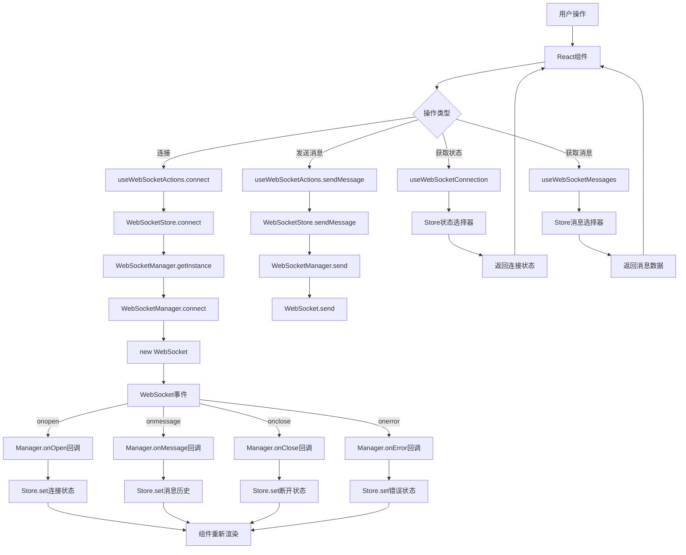
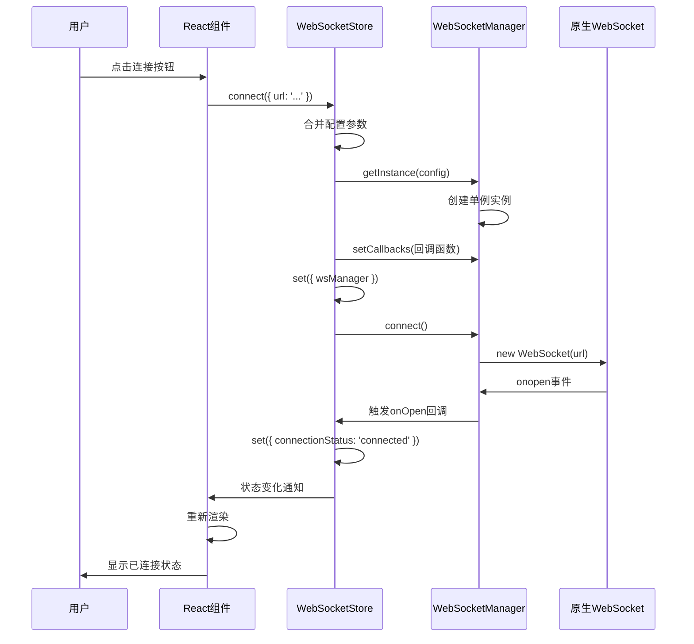
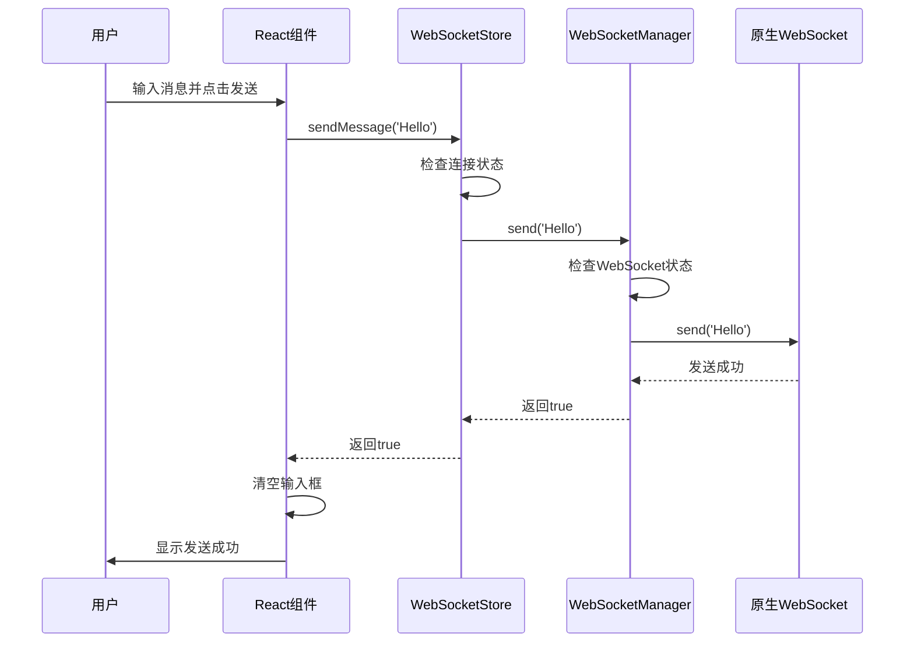
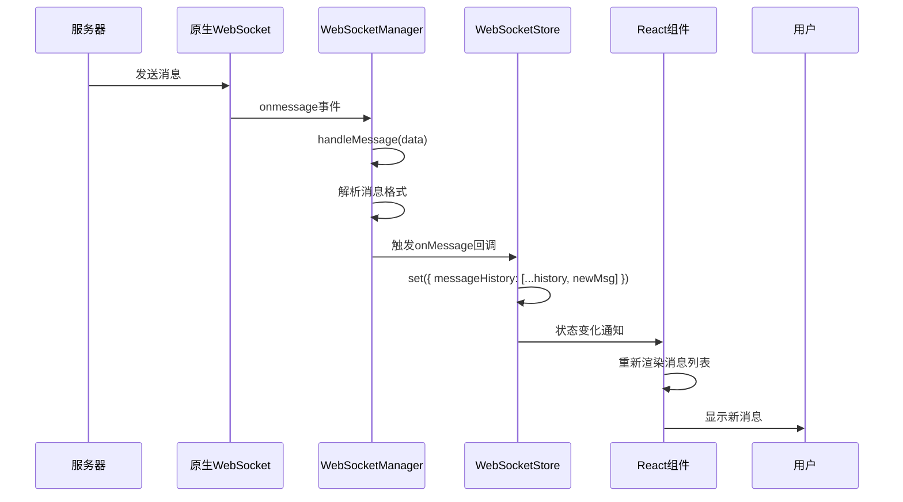

# WebSocket 数据流转详解

## 🔄 完整数据流转图



## 📋 详细时序图

### 连接建立时序



### 消息发送时序



### 消息接收时序



## 🗂️ Store数据结构详解

### 完整状态结构
```typescript
interface WebSocketStoreState {
  // === 连接状态数据 ===
  connectionStatus: 'disconnected' | 'connecting' | 'connected' | 'reconnecting' | 'error'
  isConnected: boolean              // 快速判断标志
  lastConnectedAt: number | null    // 连接时间戳
  lastDisconnectedAt: number | null // 断开时间戳
  reconnectAttempts: number         // 重连计数
  error: string | null              // 错误信息
  
  // === 消息数据 ===
  messageHistory: WebSocketMessage[] // 所有消息历史
  lastMessage: WebSocketMessage | null // 最新消息
  
  // === Manager实例 ===
  wsManager: WebSocketManager | null // 管理器引用
  
  // === 操作方法 ===
  connect: (config?) => void
  disconnect: () => void
  sendMessage: (message) => boolean
  sendChatMessage: (content, role, agentId?) => boolean
  clearMessageHistory: () => void
  clearError: () => void
  resetConnection: () => void
}
```

### 数据存储时机表

| 操作 | 存储内容 | 触发时机 | 存储位置 |
|------|----------|----------|----------|
| **连接建立** | `wsManager`, `connectionStatus`, `isConnected`, `lastConnectedAt` | WebSocket.onopen | Store |
| **连接断开** | `connectionStatus`, `isConnected`, `lastDisconnectedAt`, `error` | WebSocket.onclose | Store |
| **消息接收** | `messageHistory`, `lastMessage` | WebSocket.onmessage | Store |
| **重连开始** | `connectionStatus`, `reconnectAttempts` | Manager.scheduleReconnect | Store |
| **错误发生** | `connectionStatus`, `error` | WebSocket.onerror | Store |
| **手动清理** | `messageHistory`, `lastMessage` | 用户操作 | Store |

## 🎯 Hook选择器设计

### 性能优化的选择器模式

```typescript
// ✅ 细粒度选择器 - 只订阅需要的状态
export const useWebSocketConnection = () => {
  const connectionStatus = useWebSocketStore(state => state.connectionStatus)
  const isConnected = useWebSocketStore(state => state.isConnected)
  const error = useWebSocketStore(state => state.error)
  // 只有这些状态变化时才重新渲染
  return { connectionStatus, isConnected, error }
}

// ❌ 粗粒度选择器 - 订阅整个状态
export const useWebSocketAll = () => {
  const allState = useWebSocketStore(state => state)
  // 任何状态变化都会重新渲染，性能差
  return allState
}
```

### 专用Hook设计

```typescript
// 连接状态Hook
export const useWebSocketConnection = () => ({
  connectionStatus,    // 连接状态
  isConnected,        // 是否已连接
  error,              // 错误信息
  reconnectAttempts,  // 重连次数
  lastConnectedAt,    // 连接时间
  lastDisconnectedAt  // 断开时间
})

// 消息管理Hook
export const useWebSocketMessages = () => ({
  messageHistory,     // 所有消息
  lastMessage,        // 最新消息
  clearMessageHistory // 清空方法
})

// 操作方法Hook
export const useWebSocketActions = () => ({
  connect,           // 连接方法
  disconnect,        // 断开方法
  sendMessage,       // 发送消息
  sendChatMessage,   // 发送聊天消息
  clearError,        // 清除错误
  resetConnection    // 重置连接
})

// 过滤消息Hook
export const useChatMessages = (agentId?: number) => {
  // 使用useMemo缓存过滤结果
  return React.useMemo(() => {
    return messageHistory.filter(msg => 
      msg.type === 'chat_message' && 
      (agentId === undefined || msg.data.agentId === agentId)
    )
  }, [messageHistory, agentId])
}
```

## 🔍 实际使用场景分析

### 场景1：连接状态指示器
```typescript
const ConnectionIndicator = () => {
  // 只需要连接状态，不关心消息
  const { connectionStatus, isConnected } = useWebSocketConnection()
  
  return (
    <div className={`indicator ${isConnected ? 'connected' : 'disconnected'}`}>
      {connectionStatus}
    </div>
  )
}
```
**存储**: 连接状态变化时存储  
**取用**: 组件渲染时取用连接状态

### 场景2：消息发送器
```typescript
const MessageSender = () => {
  const { sendMessage } = useWebSocketActions()
  const { isConnected } = useWebSocketConnection()
  
  const handleSend = (text: string) => {
    if (isConnected) {
      sendMessage(text)
    }
  }
}
```
**存储**: 不需要存储，只使用操作方法  
**取用**: 取用发送方法和连接状态

### 场景3：消息历史显示
```typescript
const MessageHistory = () => {
  const { messageHistory } = useWebSocketMessages()
  
  return (
    <div>
      {messageHistory.map(msg => (
        <div key={msg.id}>{msg.content}</div>
      ))}
    </div>
  )
}
```
**存储**: 每次收到消息时存储到历史  
**取用**: 组件渲染时取用消息历史

### 场景4：特定代理的聊天
```typescript
const AgentChat = ({ agentId }: { agentId: number }) => {
  const chatMessages = useChatMessages(agentId)
  
  return (
    <div>
      {chatMessages.map(msg => (
        <div key={msg.id}>{msg.data.content}</div>
      ))}
    </div>
  )
}
```
**存储**: 所有消息存储在统一历史中  
**取用**: 通过过滤Hook取用特定代理的消息

## 💡 设计优势总结

### 1. 单一数据源 (Single Source of Truth)
- 所有WebSocket相关状态都在一个Store中
- 避免状态不一致的问题

### 2. 响应式更新
- 状态变化自动触发组件重新渲染
- 无需手动管理状态同步

### 3. 性能优化
- 细粒度选择器避免不必要的重新渲染
- useMemo缓存计算结果

### 4. 类型安全
- 完整的TypeScript类型定义
- 编译时错误检查

### 5. 易于测试
- 状态和逻辑分离
- 可以独立测试Store逻辑

### 6. 可扩展性
- 新增状态或方法只需修改Store
- 组件无需修改即可获得新功能

这种设计让WebSocket的使用变得简单、高效、可维护！🚀
